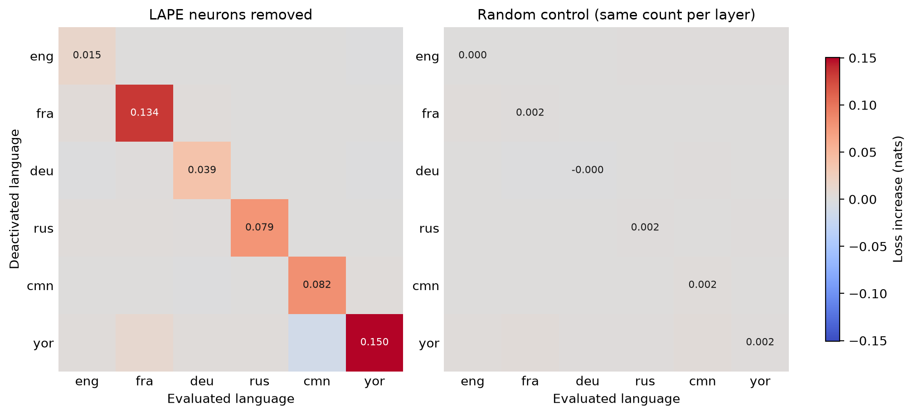
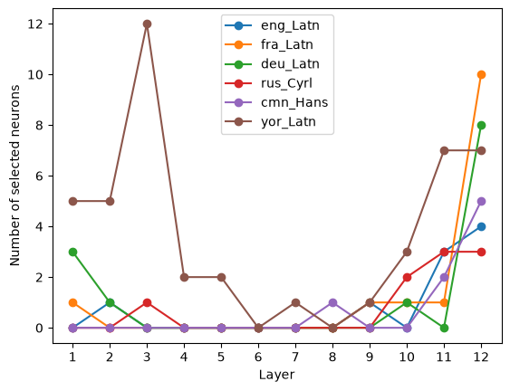

# Language-specific neurons in mBERT

Re-implementation of the LAPE method of Tang et al. (2024) on
[mBERT](https://huggingface.co/google-bert/bert-base-multilingual-cased), to
find feed-forward neurons that are specific to one language and test them
causally by setting them to zero.

Languages: English, French, German, Russian, Chinese and Yoruba, from the
[FLORES+](https://huggingface.co/datasets/openlanguagedata/flores_plus)
parallel corpus.

## What it does

1. **Activation probabilities**: for each language, count how often each of the
   12 × 3072 feed-forward neurons is active (positive output) on the `dev`
   sentences.
2. **LAPE selection**: keep the 1% of neurons with the lowest entropy across
   languages, and assign each one to the languages where its activation
   probability is above the 95th percentile.
3. **Ablation**: set the neurons of each language to zero and measure the
   masked-LM loss on the first 300 `devtest` sentences of every language,
   compared with a random control that removes the same number of neurons in
   each layer.

## Results



- **The selected neurons matter for their own language.** Removing a
  language's neurons raises its masked-LM loss much more than the loss of the
  other languages, and much more than removing the same number of random
  neurons (diagonal 0.015–0.150 nats, against at most 0.005 for the random
  control).
- **They are few, and mostly near the output.** 98 neurons are assigned to a
  language, none to several. For English, French, German, Russian and Chinese
  they sit mostly in the last two or three layers; Yoruba, the low-resource
  language, has almost half of them and peaks at layer 3.
- **"Language-specific" is relative.** Removing any one language from the set
  (not only a related one) changes about a third of the French neurons.
- **The way the effect is measured matters.** In absolute terms Yoruba looks
  the most affected; relative to each language's baseline loss, French is
  (6.4% increase), and English is the least affected either way.



## Limitations

- LAPE only finds language information carried by single neurons. If a
  language is encoded as a pattern spread over many neurons (superposition),
  this method cannot see it.
- The number of selected neurons is largely fixed by the method (1% kept,
  95th-percentile threshold), so the small number of neurons and the small
  effects do not show that mBERT shares its representations across languages.
- Activation probabilities are estimated on a few tens of thousands of tokens
  per language and only six languages, much less than in Tang et al. (2024).

## Files

| File | Content |
|---|---|
| `common.py` | Model and tokeniser loading, `encode`, cache helper, `FFNHooks` |
| `compute.py` | Computes and caches the activation probabilities |
| `ablate.py` | LAPE selection, ablations and random control (about 1 hour) |
| `analysis.ipynb` | Analysis and plots; only reads the cached results, saves figures to `results/` |


## Running

```bash
pixi run python compute.py   # activation probabilities -> cache/
pixi run python ablate.py    # selection + ablations -> cache/ (about 1 hour)
```

Then open `analysis.ipynb`. All results are cached in `cache/` with `np.save`,
so each step only runs once. Delete the corresponding `.npy` file to recompute
it.

The data and the `cache/` folder are not included in this repository.

## Reference

Tang, T. et al. (2024). *Language-Specific Neurons: The Key to Multilingual
Capabilities in Large Language Models*. ACL 2024.
